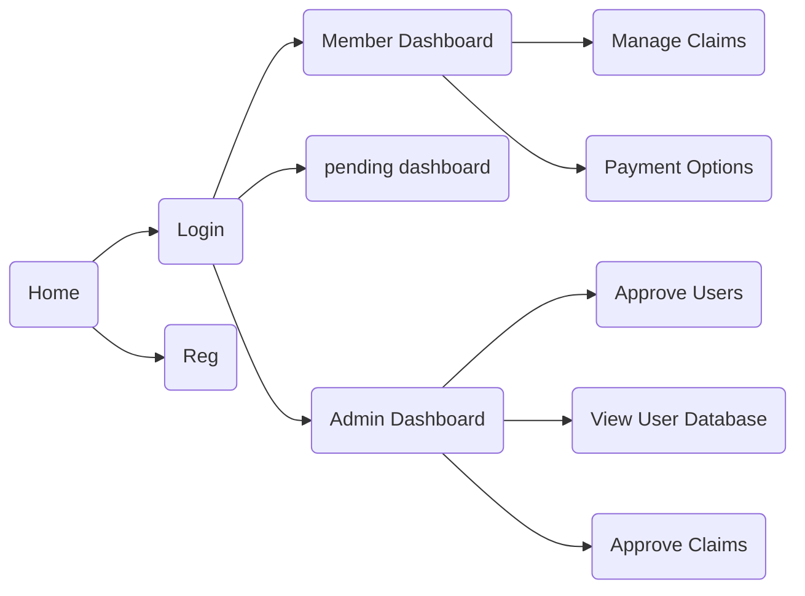

# Big Time ESD Plan

## Table of Contents

1. [Actors](#actors)
2. [Feature List](#feature-list)
   1. [Feature 1: Main Home Page](#feature-1-main-home-page)
   2. [Feature 2: Login Page](#feature-2-login-page)
   3. [Feature 3: Registration](#feature-3-registration-page)
   4. [Feature 4: Registration Approval Upon Payment](#feature-4-registration-approval-upon-payment)
   5. [Feature 5: Member Dashboard](#feature-5-member-dashboard)
   6. [Feature 6: Admin User Dashboard](#feature-6-admin-user-dashboard)
   7. [Feature 7: Session Creation](#feature-7-session-creation)
   8. [Feature 8: Claim Eligibility](# feature-8-claim-eligibility)
3. [User Stories](#user-stories)
4. [Test Plan](#test-plan)
   1. [Types of Testing](#types-of-testing)
   2. [Feature 1 Tests](#feature-1-tests)
5. [Member Preferences](#member-preferences)
6. [Links](#links)

-----

# Actors

* Admin
* Normal User

----

# Feature List

## Feature 1: Main home page

Just a bit welcome sign that has a few buttons on it to give access to all points


View:

​	

Controller:	

---

## Feature 2: Login page

Have two text inputs for username and password, then a login button.
Have another button input that redirects to the registration page.

Also requires a model for login, access to db in order to login	


Model:

​	

View:

​	

Controller:

---

## Feature 3: Registration page

Requires Model,View, and Controller

Accessed by client

Takes in name, address, dob, date of registration.

Returns: 

* a username
* auto generated password
* grant provisional membership
* requests to charge fee for membership

---

## Feature 4: Registration approval upon payment

Accessed by admin

* admin confirms fee paid

* suspends if not paid

  

---

## Feature 5: Member Dashboard

Images to fill whitespace

Displays page for user with buttons to access:

* Payment Options

* Claims Page

  


View:


Controller:

---

## Feature 6: Admin User Dashboard

Displays page for admin:

* Manage Members
* 


View:


Controller:

---

## Feature 7: Session Creation

For member to stay logged in until timeout
Requires access to previous information, cookies/session established


Model:


View:


Controller:


---

## Feature 8: Claim Eligibility

Uses Web Service to determine whether someone is eligible for a claim


Model:

​	The backend, what are the rules for assessing?

​	Are these claims legit/ within bounds?

​	What Costs for the year will occur? (Update membership costs)

View:

​	

Controller

​	Only displays if the claims are made  by someone of longer membership of 6 months

## Feature 9: Pending Member Dashboard

Images to fill whitespace

Displays page with text "Your membership is pending"

View:


Controller:

## Feature 10: Claim Application


---

# User Stories

### User

* As the user I want to send personal details for approval, so that I can have a membership account.
* As the user I want to login, so to be able apply for claims.
* As the user I want to be able to access payment options, so that I'm able 

### Admin

* As the Admin I want to login, so that I am able to reach the dashboard.
* As the Admin I want to manage account applications, to allow new users to be 

---

# Test Plan

## Types of testing

### Black Box Testing

* This is how stuff works from a user perspective
* Made from the spec
* Can be tested from complete sections


### White Box Testing

* This is how stuff works from dev perspective
* Made from the code
* You can test individual functions
* Tests can be generated as we go along
* J-unit is great for this
  

---

## Test Outline

### Black Box Test Plan

Inputs
Outputs
Constraints and limitations
Does it looks like it should?
Does it load in normal time?


### White Box Test Plan

Each Individual section listed.
What is it meant to take and reject?

#### For Model

#### For View

#### For Controller

---

# Member Preferences

Bayan: Model, View

Cris: Model, Controller 

Dan: Planning, Testing

Jason: Any

Josh: Any 

---

# Navigation



---

# Example HTML

```html

<head>
    <title>Welcome to XYZ Claims System</title>
</head>
<body>
    <h1>
    Welcome to XYZ Claims System
	</h1>
    <p>
        This system description here
    </p>
	<a href=loginpage id=loginbutton>Login</a>
	<a href=regpage id=regbutton>Register</a>
</body>

```

---

# DB Initialisation

**ALWAYS UNCHECK NULL WHEN ADDING A COLUMN**

1. Create Java DB named "PASS"

2. Connect it.

3. Create 4 Tables:

   1. USERS
      1. ID (primary key, varchar, 32)
      2. PASSWORD (varchar, 16)
      3. STATUS (varchar, 16)
   2. CLAIMS
      1. ID (primary key, int)
      2. MEM_ID (varchar, 32)
      3. DATE (date)
      4. RATIONIONALE (varchar, 64)
      5. STATUS (varchar, 16)
      6. AMOUNT (int)
   3. PAYMENTS
      1. ID (primary key, int)
      2. MEM_ID (varchar, 32)
      3. TYPE_OF_PAYMENT (varchar, 16)
      4. AMOUNT (int)
      5. DATE (timestamp)
   4. MEMBERS
      1. ID (varchar, 16)
      2. NAME (varchar, 32)
      3. ADDRESS (varchar, 128)
      4. DOB (date)
      5. DOR (date)
      6. STATUS (varchar, 16)
      7. BALANCE (int)

   ---

   # SQL Commands to Run
   
```sql
INSERT INTO users (id, password, status) VALUES
('admin', 'admin', 'ADMIN'),
('e-simons', '221165', 'APPROVED'),
('m-malcolm', '080890', 'APPROVED'),
('me-aydin', '201068', 'APPROVED'),
('mem-3', '020398', 'APPROVED'),
('mem-4', '070887', 'APPROVED'),
('r-french', '211268', 'APPROVED'),
('m-wood', '180882', 'APPROVED'),
('e-aydin', '101068', 'APPROVED'),
('mem-5', '020388', 'APPROVED'),
('mem-6', '070897', 'APPROVED');
```

```sql
INSERT INTO claims (id, mem_id, date, rationale, status, amount) VALUES
(1, 'me-aydin', '2016-04-16', 'change mirror', 'APPROVED', 120),
(2, 'me-aydin', '2016-09-08', 'repair scratch', 'APPROVED', 90),
(3, 'e-simons', '2016-10-10', 'polishing tyers', 'APPROVED', 75);
```

```SQL
INSERT INTO payments (id, mem_id, type_of_payment, amount, date) VALUES
(1, 'e-simons', 'FEE', 10, '2015-01-07 10:08:21'),
(2, 'm-malcolm', 'FEE', 10, '2015-01-24 11:28:25'),
(3, 'me-aydin', 'FEE', 10, '2015-01-26 18:00:00'),
(4, 'r-french', 'FEE', 10, '2015-01-28 09:12:00'),
(5, 'm-wood', 'FEE', 10, '2015-10-25 08:44:13'),
(6, 'e-aydin', 'FEE', 10, '2015-10-26 10:08:21'),
(7, 'e-simons', 'FEE', 10, '2016-01-25 11:00:00'),
(8, 'm-malcolm', 'FEE', 10, '2016-01-25 11:18:21'),
(9, 'me-aydin', 'FEE', 10, '2016-02-05 16:38:13'),
(10, 'm-wood', 'FEE', 10, '2016-10-12 09:44:18'),
(11, 'e-aydin', 'FEE', 10, '2016-10-20 14:42:45'),
(12, 'mem-3', 'FEE', 10, '2016-01-23 01:01:01'),
(13, 'mem-4', 'FEE', 10, '2016-05-16 11:13:11'),
(14, 'mem-5', 'FEE', 10, '2016-06-13 00:30:13'),
(15, 'mem-6', 'FEE', 10, '2016-11-06 07:13:00');
```

```sql
INSERT INTO members (id, name, address, dob, dor, status, balance) VALUES
('e-simons', 'Edmond Simons', '123 Kings Street, Aberdeen, AB12 2AB', '1965-11-22', '2015-01-03', 'APPROVED', 0),
('m-malcolm ', 'Mary Malcolm', '3 London Road, Luton, LU1 1QY', '1990-08-08', '2015-01-17', 'APPROVED', 0),
('me-aydin', 'Mehmet Aydin', '29 Station Rd, London, N3 2SG', '1968-10-20', '2015-01-26', 'APPROVED', 0),
('r-french', 'Rob French', '13 Stafford Street, Aberdeen, AB12 1AQ', '1968-12-21', '2015-01-27', 'APPROVED', 0),
('m-wood ', 'Mike Wood', '10 London Avenue, Luton, LU12 3SB', '1982-08-18', '2015-10-03', 'APPROVED', 0),
('e-aydin', 'Emin Aydin', '148 Station Rd, London, N3 2SG', '1968-10-10', '2015-10-09', 'APPLIED', 0),
('mem-3', 'Member Three', 'Address Three', '1998-03-02', '2016-01-17', 'APPROVED', 0),
('mem-4', 'Member Four', 'Address Four', '1987-07-08', '2016-04-10', 'APPROVED', 0),
('mem-5', 'Member Five', 'Address Five', '1988-03-02', '2016-06-13', 'APPROVED', 0),
('mem-6', 'Member Six', 'Address Six', '1997-07-08', '2016-10-09', 'APPROVED', 0);
```

## Links

<a  id=gitlink href="https://github.com/yatesytea/bigtimeesd">Full Project Link</a>

<a id=gogsheets href="https://docs.google.com/spreadsheets/d/1DXTQvEFn6kV4eG-qfvtgqFSeE2ST_28rcJP0cOD5Hj4/edit?usp=sharing">Sprint Docs</a>

<a id=logs href="https://docs.google.com/document/d/1tv6pBWNG2S4F1PeunVcP6EQp7c0JF7EVHmuRfZmk6g4/edit">Non Git Logs</a>


[Back To Top](#table-of-contents)
