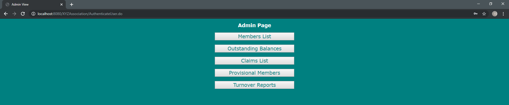

# Test Plan

## Types of testing

### Black Box Testing

* This is how stuff works from a user perspective
* Made from the spec
* Can be tested from complete sections

### White Box Testing

* This is how stuff works from dev perspective
* Made from the code
* You can test individual functions
* Tests can be generated as we go along
* J-unit is great for this

---

## Test Outline

### Black Box Test Plan

Inputs
Outputs
Constraints and limitations
Does it looks like it should?
Does it load in normal time?

### White Box Test Plan

Each Individual section listed.
What is it meant to take and reject?

#### For Model

#### For View

#### For Controller

## Feature 2 Black Box Test

### Case 1

**Input:** Non-existing username and password then click login.
**Expected output:** Stays on page plus displays "Error: Incorrect username and/or password, please try again."
**Actual Output:** Recognises the login fails however doesn't provide error message on failure, instead logs them in

### Case 2

**Input:** Valid Pending Member Username and Password, then click login.
**Expected output:** Takes you to the Pending Dashboard
**Actual Output:** member logs in however no pending screen

### Case 3

**Input:** Valid Member Username and Password, then click login.
**Expected output:** Takes you to the Member Dashboard
**Actual Output:** Member logs in successfully 

### Case 4

**Input:** Valid Admin Username and Password, then click login.
**Expected output:** Takes you to the Admin Dashboard
**Actual Output:** Successfully recognises admin but doesn't go to admin page

**Output after fix:** Displays admin page correctly, this was due to a section of the model not linking with jsp correctly

## Feature 3 Black Box Test

Inputs: Name (Varchar,32 ), Address (Varchar, 128), Date of Birth (Date format: YYYY-MM-DD), Date of Registration (Date format: YYY-MM-DD)

### Case 1

**Input:** Name null, all others within acceptable limits, then click 'register' button.
**Expected output:** Stays on page, with all inputs still present and displays error message of: "Error: Name not valid"
**Actual Output:**

### Case 2

**Input:** Name longer than 32 characters, all others within acceptable limits then click 'register' button.
**Expected output:** Stays on page, with all inputs still present and displays error message of: "Error: Name not valid"
**Actual Output:**