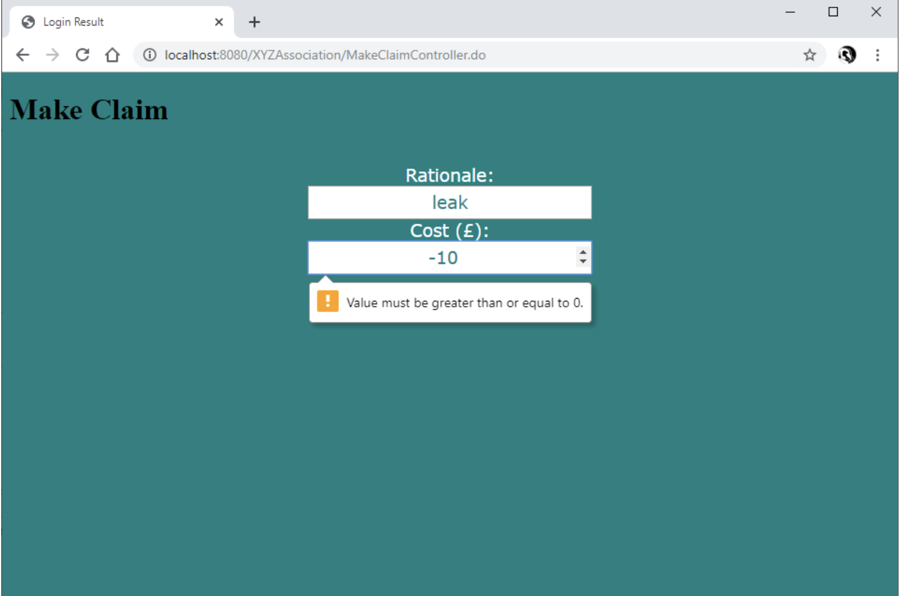

Test Plan

## Types of testing

### Black Box Testing

* This is how stuff works from a user perspective
* Made from the spec
* Can be tested from complete sections

### White Box Testing

* This is how stuff works from dev perspective
* Made from the code
* You can test individual functions
* Tests can be generated as we go along
* J-unit is great for this

---

## Test Outline

### Black Box Test Plan

Inputs
Outputs
Constraints and limitations
Does it looks like it should?
Does it load in normal time?

### White Box Test Plan

Each Individual section listed.
What is it meant to take and reject?

#### For Model

#### For View

#### For Controller

### Table for Test Plan

| Feature Name | Input                                               | Expected Output              | Actual Output | Notes |
| :----------- | --------------------------------------------------- | ---------------------------- | ------------- | ----- |
| Login Page   | admin username admin password click login | Displays the admin dashboard |  |       |
| Login Page   | standard username standard password click login | Displays the user dashboard  |  |       |
| Session time out           | no input required | session expires after 20 minutes | Not sure if this function is working |       |
| Create an account | Enter full name Enter Address Enter date of birth Enter password then re enter password again password have to match click sign up | New account to be Created. |    |       |
| Trying to log in as a non approved member | standard username standard password click login | Messege appear on screen:none approved member |  | |
| member dashboard functions: 1.Check outstanding balance | Clik on outstanding balance | Balance should be shown on the screen |  | |
| 2.Make a payment | Click on make payment  | Payments displayed on the screen |  |       |
| 3.Submit a claim | Click on make a claim enter claim enter value  | Claim should be submitted if the cost number is enterd correctly |  |       |
| 3.1 value can not be less than 0 (no negative value) | enter a value | if value is less than 0  it will reject the value |  | |
| 3.2 value has to be 2 decimal points | enter a value | if value has more than 2 decimal points it will reject value |  | |
| Admin dashboard functions: 1.List all members | click on  mebmers list button | list of all members should display on screen |  |       |
| 2.List all outstanding balances | click on outstanding balances button | Outstanding balances should display on screen | Doesn't work |       |
| 3.List all claims | click onl claims list button | list of all claims should display on screen |  |       |
| 4.List all provisional members | click on provisional members button | list of all provisional members should display on screen |  |       |
| 5.Process individual claims |                                                     |                              | doesnt work |       |
| 6.Process membership applications and upgrade if payment is made |                                                     |                              | Might work |       |
| 7.Suspend/Resume membership |                                                     |                              | might work |       |
| 8.Report annual turnover including total income and total pay-outs |                                                     |                              | Doesn't work |       |
|              |                                                     |                              |               |       |
|              |                                                     |                              |               |       |
|              |                                                     |                              |               |       |
|              |                                                     |                              |               |       |
|              |                                                     |                              |               |       |
|              |                                                     |                              |               |       |
|              |                                                     |                              |               |       |
|              |                                                     |                              |               |       |
|              |                                                     |                              |               |       |
|              |                                                     |                              |               |       |
|              |                                                     |                              |               |       |
|              |                                                     |                              |               |       |
|              |                                                     |                              |               |       |
|              |                                                     |                              |               |       |
|              |                                                     |                              |               |       |
|              |                                                     |                              |               |       |
|              |                                                     |                              |               |       |
|              |                                                     |                              |               |       |
|              |                                                     |                              |               |       |
|              |                                                     |                              |               |       |
|              |                                                     |                              |               |       |
|              |                                                     |                              |               |       |
|              |                                                     |                              |               |       |
|              |                                                     |                              |               |       |
|              |                                                     |                              |               |       |
|              |                                                     |                              |               |       |
|              |                                                     |                              |               |       |
|              |                                                     |                              |               |       |
|              |                                                     |                              |               |       |
|              |                                                     |                              |               |       |
|              |                                                     |                              |               |       |
|              |                                                     |                              |               |       |
|              |                                                     |                              |               |       |
|              |                                                     |                              |               |       |
|              |                                                     |                              |               |       |
|              |                                                     |                              |               |       |
|              |                                                     |                              |               |       |
|              |                                                     |                              |               |       |
|              |                                                     |                              |               |       |
|              |                                                     |                              |               |       |
|              |                                                     |                              |               |       |
|              |                                                     |                              |               |       |
|              |                                                     |                              |               |       |
|              |                                                     |                              |               |       |
|              |                                                     |                              |               |       |

## Feature 2 Black Box Test

### Case 1

**Input:** Non-existing username and password then click login.
**Expected output:** Stays on page plus displays "Error: Incorrect username and/or password, please try again."
**Actual Output:** Recognises the login fails however doesn't provide error message on failure, instead logs them in

### Case 2

**Input:** Valid Pending Member Username and Password, then click login.
**Expected output:** Takes you to the Pending Dashboard
**Actual Output:** member logs in however no pending screen

### Case 3

**Input:** Valid Member Username and Password, then click login.
**Expected output:** Takes you to the Member Dashboard
**Actual Output:** Member logs in successfully 

### Case 4

**Input:** Valid Admin Username and Password, then click login.
**Expected output:** Takes you to the Admin Dashboard
**Actual Output:** Successfully recognises admin but doesn't go to admin page

**Output after fix:** Displays admin page correctly, this was due to a section of the model not linking with jsp correctly

## Feature 3 Black Box Test

Inputs: Name (Varchar,32 ), Address (Varchar, 128), Date of Birth (Date format: YYYY-MM-DD), Date of Registration (Date format: YYY-MM-DD)

### Case 1

**Input:** Name null, all others within acceptable limits, then click 'register' button.
**Expected output:** Stays on page, with all inputs still present and displays error message of: "Error: Name not valid"
**Actual Output:**

### Case 2

**Input:** Name longer than 32 characters, all others within acceptable limits then click 'register' button.
**Expected output:** Stays on page, with all inputs still present and displays error message of: "Error: Name not valid"
**Actual Output:**
