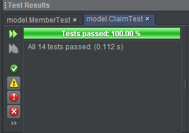
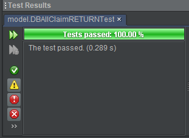
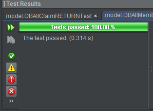
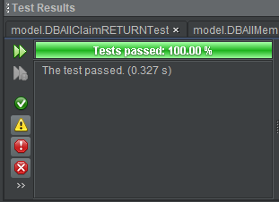
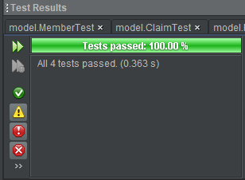
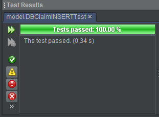
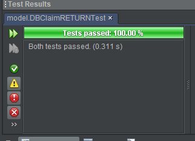
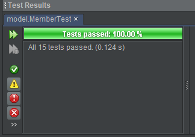
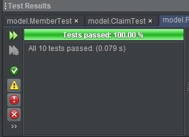

# White Box Unit Testing

[toc]

# Model

## [Claim](file:///C:/Users/Yates/Documents/GitHub/bigTimeESD/XYZAssociation/dist/javadoc/model/Claim.html)

| Method                     | Test Name            |
| ------------------------------------------ | -------------------- |
| `display()`                                | `testDisplay()`      |
| `getAmount()`                              | `testgetAmount()`    |
| `getDate()`                                | `testgetDate()`      |
| `getId()`                                  | `testgetId()`        |
| `getMem_id()`                              | `testgetMem_id()`    |
| `getRationale()`                           | `testgetRationale()` |
| `getStatus()`                              | `testgetStatus()`    |
| `setAmount(double amount)`                 | `testsetAmount()`    |
| `setAmount(double amount)`                 | `testsetNonDoubleAmount()` |
| `setDate(java.lang.String date)`           | `testsetDate()`      |
| `setDate(java.lang.String date)`           | `testsetNonDate()` |
| `setId(int id)`                            | `testsetId()`   		|
| `setId(int id)`                            | `testsetNonIntId()` |
| `setMem_id(java.lang.String mem_id)`       | `testsetMem_id()` 	|
| `setMem_id(java.lang.String mem_id)` | `testsetInvalidMem_id()` |
| `setRationale(java.lang.String rationale)` | `testsetRationale()` |
| `setStatus(java.lang.String status)`       | `testsetStatus()` |
| `setStatus(java.lang.String status)` | `testsetInvalidStatus()` |

Test Result:

## [DBAllClaimRETURN](file:///C:/Users/Yates/Documents/GitHub/bigTimeESD/XYZAssociation/dist/javadoc/model/DBAllClaimRETURN.html)

| Modifier and Type     | Method and Description | Test Name         |
| --------------------- | ---------------------- | ----------------- |
| `java.util.ArrayList` | `getClaims()`          | `getValidClaim()` |

Test Result:

## [DBAllMemberRETURN](file:///C:/Users/Yates/Documents/GitHub/bigTimeESD/XYZAssociation/dist/javadoc/model/DBAllMemberRETURN.html)

| Modifier and Type     | Method and Description | Test Name         |
| --------------------- | ---------------------- | ----------------- |
| `java.util.ArrayList` | `getMember()`          | `testGetMember()` |

Test Result:

## [DBAppliedMemberRETURN](file:///C:/Users/Yates/Documents/GitHub/bigTimeESD/XYZAssociation/dist/javadoc/model/DBAppliedMemberRETURN.html)

| Modifier and Type     | Method and Description | Test Name                   |
| --------------------- | ---------------------- | --------------------------- |
| `java.util.ArrayList` | `getMember()`          | `testGetAllAppliedMember()` |

Test Result:

## [DBAuthenticatorBean](file:///C:/Users/Yates/Documents/GitHub/bigTimeESD/XYZAssociation/dist/javadoc/model/DBAuthenticatorBean.html)

| Modifier and Type | Method and Description                                | Test Name                     |
| ----------------- | ----------------------------------------------------- | ----------------------------- |
| `User`            | `login(java.lang.String name, java.lang.String pass)` | `testAdminLogin()`            |
| `User`            | `login(java.lang.String name, java.lang.String pass)` | `testUserLogin()`             |
| `User`            | `login(java.lang.String name, java.lang.String pass)` | `testInvalidLogin()`          |
| `User`            | `login(java.lang.String name, java.lang.String pass)` | `testAdminLoginBadPassword()` |

Test Result:

## [DBClaimINSERT](file:///C:/Users/Yates/Documents/GitHub/bigTimeESD/XYZAssociation/dist/javadoc/model/DBClaimINSERT.html)

| Modifier and Type  | Method and Description                                       | Test Name         |
| ------------------ | ------------------------------------------------------------ | ----------------- |
| `java.lang.String` | `makeClaim(java.lang.String memID, java.lang.String rationale, double amount)` | `testMakeClaim()` |

Test Result:

## [DBClaimRETURN](file:///C:/Users/Yates/Documents/GitHub/bigTimeESD/XYZAssociation/dist/javadoc/model/DBClaimRETURN.html)

| Modifier and Type     | Method and Description | Test Name                |
| --------------------- | ---------------------- | ------------------------ |
| `java.util.ArrayList` | `getClaims()`          | `testValidGetClaims()`   |
| `java.util.ArrayList` | `getClaims()`          | `testGetInvalidClaims()` |

Test Result:

## [DBMemberRETURN](file:///C:/Users/Yates/Documents/GitHub/bigTimeESD/XYZAssociation/dist/javadoc/model/DBMemberRETURN.html)

| Modifier and Type     | Method and Description             | Test name         |
| --------------------- | ---------------------------------- | ----------------- |
| `java.util.ArrayList` | `getMember(java.lang.String name)` | `testGetMember()` |

Test (1) Result: Awaiting Github update for class update, error found name was being used rather than Id.

## 

## [DBPaymentINSERT](file:///C:/Users/Yates/Documents/GitHub/bigTimeESD/XYZAssociation/dist/javadoc/model/DBPaymentINSERT.html)

## [DBPaymentRETURN](file:///C:/Users/Yates/Documents/GitHub/bigTimeESD/XYZAssociation/dist/javadoc/model/DBPaymentRETURN.html)

## [DBRegisterBean](file:///C:/Users/Yates/Documents/GitHub/bigTimeESD/XYZAssociation/dist/javadoc/model/DBRegisterBean.html)

## [Member](file:///C:/Users/Yates/Documents/GitHub/bigTimeESD/XYZAssociation/dist/javadoc/model/Member.html)

| Method and Description                 | Test Name          |
| -------------------------------------- | ------------------ |
| `display()`                            | `testDisplay()`    |
| `getAddress()`                         | `testGetAddress()` |
| `getBalance()`                         | `testGetBalance()` |
| `getDob()`                             | `testGetDob()`     |
| `getDor()`                             | `testGetDor()`     |
| `getId()`                              | `testGetId()`      |
| `getName()`                            | `testGetName()`    |
| `getStatus()`                          | `testGetStatus()`  |
| `setAddress(java.lang.String address)` | `testSetAddress()` |
| `setBalance(double balance)`           | `testSetBalance()` |
| `setDob(java.lang.String dob)`         | `testSetDob()`     |
| `setDor(java.lang.String dor)`         | `testSetDor()`     |
| `setId(java.lang.String id)`           | `testSetId()`      |
| `setName(java.lang.String name)`       | `testSetName()`    |
| `setStatus(java.lang.String status)`   | `testSetStatus()`  |

Test Set Result:

## [Payment](file:///C:/Users/Yates/Documents/GitHub/bigTimeESD/XYZAssociation/dist/javadoc/model/Payment.html)

| Modifier and Type  | Method and Description                                 | Test Name                  |
| ------------------ | ------------------------------------------------------ | -------------------------- |
| `int`              | `getAmount()`                                          | `testGetAmount()`          |
| `java.lang.String` | `getDate()`                                            | `testGetDate()`            |
| `int`              | `getId()`                                              | `testGetId()`              |
| `java.lang.String` | `getMem_id()`                                          | `testGetMem_id()`          |
| `java.lang.String` | `getType_of_payment()`                                 | `testGetType_of_payment()` |
| `void`             | `setAmount(int amount)`                                | `testSetAmount()`          |
| `void`             | `setDate(java.lang.String date)`                       | `testSetDate()`            |
| `void`             | `setId(int id)`                                        | `testSetId()`              |
| `void`             | `setMem_id(java.lang.String mem_id)`                   | `testSetMem_id()`          |
| `void`             | `setType_of_payment(java.lang.String type_of_payment)` | `testSetType_of_payment()` |

Test Set Result:

## [RegisterBean](file:///C:/Users/Yates/Documents/GitHub/bigTimeESD/XYZAssociation/dist/javadoc/model/RegisterBean.html)

## [User](file:///C:/Users/Yates/Documents/GitHub/bigTimeESD/XYZAssociation/dist/javadoc/model/User.html)

| Method                                   | Test Name |
| ---------------------------------------- | --------- |
| `getName()`                              |`testGetName()`    	|
| `getPassword()`                          |`testGetPassword()`	|
| `getStatus()`                            |`testGetStatus()`  	|
| `setName(java.lang.String name)`         |`testSetName()`		|
| `setPassword(java.lang.String password)` |`testSetPassword()`	|
| `setStatus(java.lang.String status)` |`testSetStatus()`	|

# Controller

## [AdminClaimsListController](file:///C:/Users/Yates/Documents/GitHub/bigTimeESD/XYZAssociation/dist/javadoc/controller/AdminClaimsListController.html)

## [AdminMembersListController](file:///C:/Users/Yates/Documents/GitHub/bigTimeESD/XYZAssociation/dist/javadoc/controller/AdminMembersListController.html)

## [AdminOutstandingBalanceController](file:///C:/Users/Yates/Documents/GitHub/bigTimeESD/XYZAssociation/dist/javadoc/controller/AdminOutstandingBalanceController.html)

## [AdminProvisionalMembersController](file:///C:/Users/Yates/Documents/GitHub/bigTimeESD/XYZAssociation/dist/javadoc/controller/AdminProvisionalMembersController.html)

## [AdminTurnoverReportsController](file:///C:/Users/Yates/Documents/GitHub/bigTimeESD/XYZAssociation/dist/javadoc/controller/AdminTurnoverReportsController.html)

## [AuthenticateUser](file:///C:/Users/Yates/Documents/GitHub/bigTimeESD/XYZAssociation/dist/javadoc/controller/AuthenticateUser.html)

## [CheckCookie](file:///C:/Users/Yates/Documents/GitHub/bigTimeESD/XYZAssociation/dist/javadoc/controller/CheckCookie.html)

## [MakeClaimController](file:///C:/Users/Yates/Documents/GitHub/bigTimeESD/XYZAssociation/dist/javadoc/controller/MakeClaimController.html)

## [MakePaymentController](file:///C:/Users/Yates/Documents/GitHub/bigTimeESD/XYZAssociation/dist/javadoc/controller/MakePaymentController.html)

## [RegistrationController](file:///C:/Users/Yates/Documents/GitHub/bigTimeESD/XYZAssociation/dist/javadoc/controller/RegistrationController.html)

## [ShowClaimsAndPayments](file:///C:/Users/Yates/Documents/GitHub/bigTimeESD/XYZAssociation/dist/javadoc/controller/ShowClaimsAndPayments.html)

## [SubmitClaimController](file:///C:/Users/Yates/Documents/GitHub/bigTimeESD/XYZAssociation/dist/javadoc/controller/SubmitClaimController.html)

